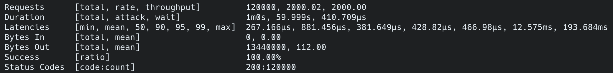

### Зависимости необходимые для запуска приложения
```
make, docker
```

### Команды для управления состоянием приложения
```
make up - запуск
make down - завершить
make force-down - завершить с удалением docker volumes
```

### Запросы
```
Создать кошелек: 
POST localhost:port/api/v1/wallets
Body: empty

Получить баланс кошелька:
GET localhost:port/api/v1/wallets/:id

Создать транзакцию:
POST localhost:port/api/v1/transactions
Body: {"wallet_id": uuid, "operation_type": "deposit", "amount": 100}
```

### Результаты нагрузочного тестирования
```2000 RPS в течение 1 минуты```


